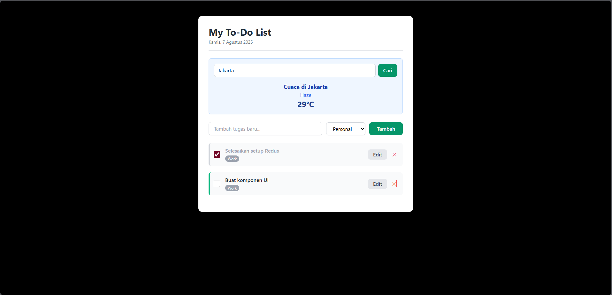

# Aplikasi To-Do List Canggih

Selamat datang di proyek Aplikasi To-Do List Canggih! Ini bukan sekadar aplikasi daftar tugas biasa. Proyek ini adalah sebuah demonstrasi komprehensif tentang bagaimana membangun aplikasi web modern dan kaya fitur menggunakan React, Redux, dan Redux Saga untuk manajemen state yang kompleks dan operasi asinkron.

## Tampilan Aplikasi



---

## Fitur Utama

-   **Manajemen Tugas (CRUD)**: Tambah, edit, dan hapus tugas dengan mudah.
-   **Tandai Selesai**: Lacak progres Anda dengan menandai tugas yang telah selesai.
-   **Filter & Pencarian Dinamis**: Saring tugas berdasarkan status (selesai/belum), kategori (Pribadi, Kerja, dll.), atau cari berdasarkan kata kunci secara instan.
-   **Ubah Urutan (Drag & Drop)**: Atur prioritas tugas Anda dengan mudah menggunakan fungsionalitas seret dan lepas (*drag-and-drop*).
-   **Widget Cuaca Live**: Menampilkan data cuaca terkini dari lokasi yang bisa dipilih, menunjukkan contoh integrasi API eksternal yang asinkron.

---

## Tumpukan Teknologi

-   **React**: Library JavaScript untuk membangun antarmuka pengguna yang interaktif.
-   **Redux**: Untuk manajemen state yang terpusat dan dapat diprediksi.
-   **Redux Saga**: Middleware untuk menangani *side effects* (seperti pemanggilan API) dengan cara yang bersih dan mudah diuji.
-   **@hello-pangea/dnd**: Untuk fungsionalitas *drag-and-drop* yang mulus dan aksesibel.
-   **Axios**: Klien HTTP berbasis Promise untuk melakukan permintaan ke API cuaca.
-   **Tailwind CSS**: Framework CSS modern untuk styling yang cepat dan responsif.
-   **Vite**: Alat build generasi baru yang memberikan pengalaman pengembangan super cepat.

---

## Struktur Proyek

```
src/
├── api/            # Logika pemanggilan API (cuaca, dll.)
├── assets/         # Aset statis seperti gambar
├── components/     # Komponen React yang dapat digunakan kembali
├── redux/          # Semua logika Redux & Redux Saga
├── App.jsx         # Komponen utama aplikasi
└── main.jsx        # Titik masuk aplikasi
```

---

## Instalasi & Menjalankan Proyek

Untuk menjalankan proyek ini di lingkungan lokal Anda, ikuti langkah-langkah berikut:

1.  **Kloning Repositori**
    ```bash
    git clone [URL_REPOSITORI_ANDA]
    cd [NAMA_DIREKTORI]
    ```

2.  **Instal Dependensi**
    Pastikan Anda memiliki Node.js terinstal. Jalankan perintah berikut di terminal:
    ```bash
    npm install
    ```

3.  **Jalankan Server Pengembangan**
    Perintah ini akan memulai server Vite dan membuka aplikasi di browser.
    ```bash
    npm run dev
    ```

4.  Buka browser dan kunjungi `http://localhost:5173` (atau alamat lain yang ditampilkan di terminal).
